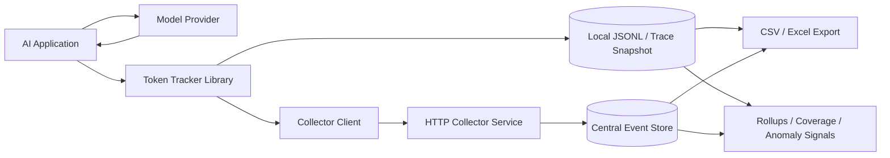
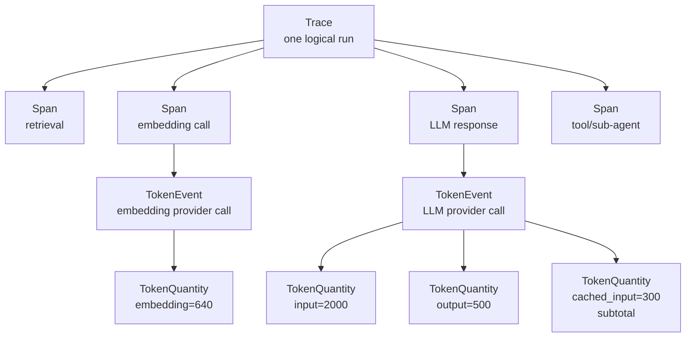
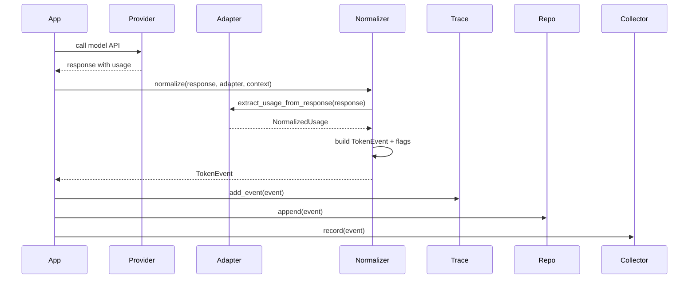
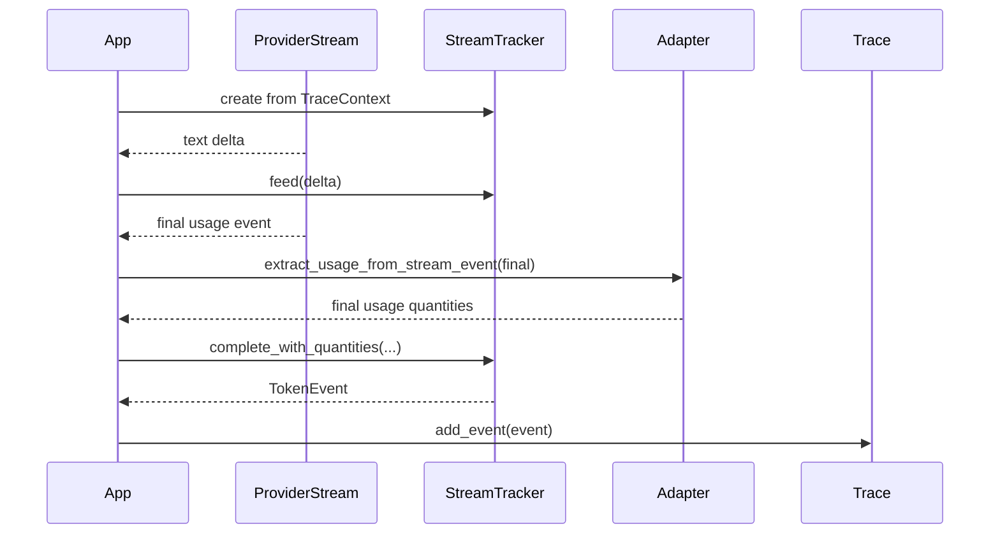
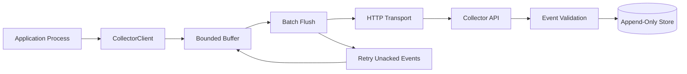
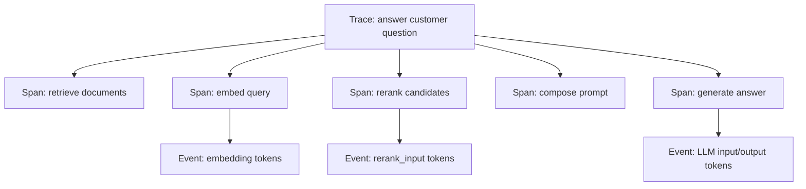
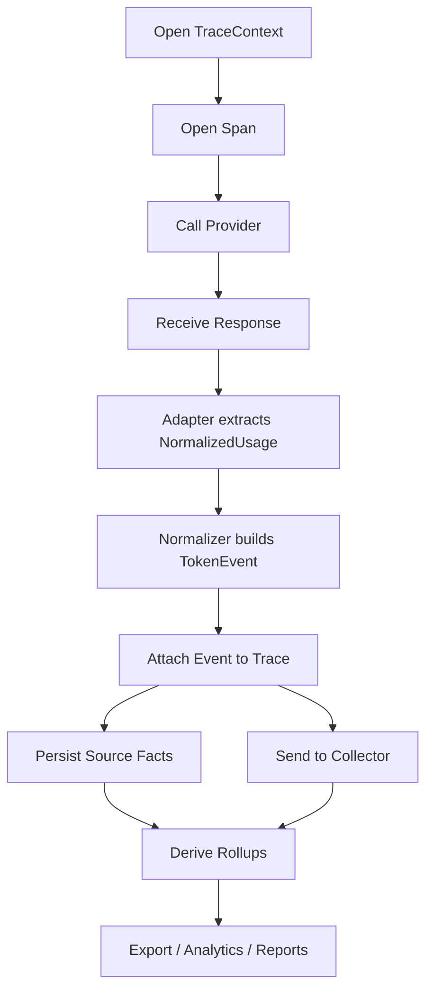

# AI Token Tracker Architecture

Conceptual target architecture and intended operating model

Audience: engineering, architecture, platform, audit, and observability teams

Purpose: explain how the tracker should work end to end, how every component connects, and
which invariants keep token totals correct.

Note: this presentation describes the intended architecture and design contracts. It is not
a claim that every current implementation detail is already perfect.

---

## 1. Executive Summary

The AI Token Tracker is an observability layer for GenAI, RAG, agentic, and proxy-based
workloads.

Its job is to capture provider token usage as structured facts, attach those facts to
trace/span identity, persist them safely, and derive totals without double counting.

The central design rule is simple:

Stored data is source-of-truth facts only. Totals are derived later.

---

## 2. The Problem We Are Solving

Modern AI applications call many model surfaces:

- chat completions
- responses APIs
- embeddings
- rerank APIs
- streaming responses
- RAG pipelines
- tool-using agents
- sub-agents
- proxy-routed external tools

Each provider reports usage differently. Some fields are true additive token counts, some
are subtotals, some are estimates, and some have unverified semantics.

If these fields are summed naively, totals become wrong.

---

## 3. The Architectural Promise

The tracker should guarantee:

- every provider call becomes one normalized `TokenEvent`
- every quantity inside the event has explicit meaning
- every quantity declares whether it contributes to totals
- provider totals are used for reconciliation, not aggregation
- retry/stream superseded events contribute zero
- unknown counts are visible, not silently treated as zero
- export totals can be safely recomputed from stored facts
- tracking failures never break the application being observed

---

## 4. System Context



The tracker sits beside model calls. It observes responses and streams, but it should not
own business logic, prompts, credentials, or provider execution.

---

## 5. Core Conceptual Objects

| Object | Purpose | Stored? |
|---|---|---:|
| `TraceContext` | ambient identity carried through code and headers | yes, inside events/spans |
| `Trace` | one logical workflow run | yes |
| `Span` | one unit of work inside a trace | yes |
| `TokenEvent` | one observed provider call or terminal stream state | yes |
| `TokenQuantity` | one token measurement inside an event | yes |
| derived totals | rollups and contribution calculations | no |

The architecture is event-first. Totals are always projections over events.

---

## 6. Trace, Span, Event, Quantity



The trace gives business context. The span gives workflow structure. The event captures one
provider observation. The quantities capture token facts.

---

## 7. The Most Important Boundary

Stored fields:

- identity: trace, span, request correlation
- provider facts: provider, model, API surface
- raw observed usage: quantities and provider total
- quality flags
- hashes and observation metadata

Derived fields:

- `quantity_in_total`
- `event_contributing_tokens`
- `event_total_mismatch`
- trace totals
- export warnings

Derived fields should never be stored as source-of-truth.

---

## 8. Why Derived Totals Must Not Be Stored

Stored totals become dangerous when rules evolve.

Example:

- OpenAI reports `input_tokens=1000`
- OpenAI also reports `cached_tokens=800`
- The cached count is a slice of input
- Raw sum is `1800`
- Correct contribution is `1000`

If a stored total was computed wrongly once, the database is polluted. If only source facts
are stored, totals can be recomputed correctly forever.

---

## 9. Quantity Additivity

Every `TokenQuantity` needs an additivity classification:

| Additivity | Meaning | Contribution |
|---|---|---:|
| `total_contributing` | count is an additive bucket | `quantity` |
| `subtotal_of` | count is a slice of another bucket | `0` |
| `unverified` | semantics not proven | `0` plus flag |

No token type should be assumed additive from its name.

Additivity is assigned by the provider adapter through a central table.

---

## 10. Precision and Source

Token meaning is separated from measurement quality.

`token_type` answers: what is being counted?

- input
- output
- cached input
- reasoning
- thinking
- embedding
- rerank input
- audio/image/video modality

`precision_level` answers: how reliable is the count?

- exact
- estimate
- unknown

`usage_source` answers: where did it come from?

- provider response
- provider stream final
- local tokenizer
- partial stream tokenizer
- historical forecast
- none

---

## 11. Provider Adapter Responsibility

An adapter translates a provider-specific payload into normalized usage facts.

It should:

1. find the provider usage object
2. extract provider token fields
3. map each field to a `TokenType`
4. assign `PrecisionLevel`
5. assign `UsageSource`
6. assign `Additivity` and `subtotal_of`
7. preserve raw `provider_total_tokens` when present
8. return adapter-owned quality flags such as `raw_usage_missing`

It should not compute event totals, trace totals, persistence, or supersession.

---

## 12. Normalizer Responsibility

The normalizer is the single assembly point.

It should:

1. receive raw provider response plus adapter
2. resolve context from explicit argument or ambient context
3. call the adapter defensively
4. receive normalized quantities and raw provider total
5. reconcile provider total as raw event data
6. add normalizer-owned quality flags
7. build a `TokenEvent`
8. return an event even on adapter failure

The normalizer should not persist anything and should not compute stored totals.

---

## 13. Non-Streaming Event Flow



The provider call completes first. Tracking observes the response after the fact.

---

## 14. Non-Streaming Flow: Precise Steps

1. Application opens or receives a `TraceContext`.
2. Application enters a span for the unit of work.
3. Application calls provider.
4. Provider returns response.
5. Application selects adapter by provider and API surface.
6. Application calls `track_response` or `normalize`.
7. Adapter extracts usage fields into `TokenQuantity` objects.
8. Normalizer assembles a `TokenEvent`.
9. Event is attached to the current trace.
10. Event is optionally appended to local storage.
11. Event is optionally sent to collector client.
12. Later, rollups/export compute totals from derived properties.

---

## 15. Context Propagation

`TraceContext` is the identity spine.

It carries:

- `trace_id`: one logical run
- `span_id`: one unit of work
- `parent_span_id`: parent-child structure
- `request_correlation_id`: one provider attempt
- `business_id`: external business key
- `workflow`: workflow name
- `environment`: dev/test/prod label

The active context should be task-local, not global mutable state.

---

## 16. Cross-Service Propagation

When a request crosses a service boundary, context should be serialized into headers.

```text
X-TokenTracker-Trace-Id
X-TokenTracker-Span-Id
X-TokenTracker-Request-Correlation-Id
X-TokenTracker-Parent-Span-Id
X-TokenTracker-Business-Id
X-TokenTracker-Workflow
X-TokenTracker-Environment
```

Receiving services should:

1. extract headers case-insensitively
2. validate required identity
3. open a child span
4. flag `propagation_lost` if tracker headers were present but invalid
5. avoid silently re-rooting broken propagation

---

## 17. Retry Identity

Retries are not new spans by default.

Ideal behavior:

- same `trace_id`
- same `span_id`
- new `request_correlation_id`
- each attempt can produce a separate event
- supersession decides which event contributes

This separates "the same unit of work" from "a specific provider attempt".

---

## 18. Supersession

Supersession prevents double counting when multiple events represent the same logical
provider call lifecycle.

Common cases:

- interrupted stream later resolved by final provider usage
- retry attempt replaces a previous attempt
- partial estimate replaced by exact count

Rule:

If an event is superseded, its contribution is zero.

The event remains stored for auditability.

---

## 19. Streaming Architecture

Streaming differs because exact usage may arrive late, never arrive, or arrive only at the
terminal event.

The stream tracker should handle four terminal states:

| State | Quantity | Precision | Contribution |
|---|---|---|---:|
| complete with provider usage | provider final input/output | exact | yes |
| interrupted | local estimate over seen text | estimate | yes, unless superseded |
| timeout | missing output quantity | unknown | 0 |
| final usage after interrupt | provider final usage | exact | yes; supersedes partial |

---

## 20. Streaming Flow



The stream tracker accumulates text only for fallback estimation. Exact provider usage
should win whenever available.

---

## 21. Data Quality Flags

Quality flags are part of observability, not failure noise.

Expected flag examples:

- `raw_usage_missing`
- `normalization_error`
- `unverified_additivity`
- `unknown_quantity_present`
- `provider_total_mismatch`
- `partial_stream_estimate`
- `stream_interrupted`
- `propagation_lost`

Each flag should have one clear producer. This prevents duplicated or contradictory
diagnostics.

---

## 22. Provider Total Reconciliation

Provider totals are raw event-level facts.

They are useful for reconciliation:

```text
event_total_mismatch = provider_total_tokens - sum(quantity_in_total)
```

They must not be summed across events.

Why:

- provider totals may include different semantics by surface
- retries can produce multiple provider totals
- stream partial/final states can duplicate a logical call
- trace totals must respect supersession and authority

---

## 23. Correct Total Formula

Quantity grain:

```text
quantity_in_total =
  quantity if additivity == total_contributing and quantity is known
  else 0
```

Event grain:

```text
event_contributing_tokens =
  0 if event.superseded
  0 if event.observation.authoritative == false
  else sum(quantity.quantity_in_total)
```

Trace grain:

```text
trace_total = sum(event.event_contributing_tokens for event in trace.events)
```

Never sum raw `quantity`. Never sum `provider_total_tokens`.

---

## 24. Provider Semantics Examples

| Provider/surface | Field | Intended token_type | Additivity |
|---|---|---|---|
| OpenAI chat/responses | input tokens | input | total_contributing |
| OpenAI chat/responses | output tokens | output | total_contributing |
| OpenAI | cached tokens | cached_input | subtotal_of input |
| OpenAI | reasoning tokens | reasoning | subtotal_of output |
| Gemini | thoughts/thinking | thinking | total_contributing |
| Gemini | image/audio/video details | modality token types | subtotal_of input/output |
| Anthropic | cache read | cached_input | total_contributing |
| Anthropic | cache creation | cache_creation_input | total_contributing |
| Bedrock cache | cache fields | cache token types | unverified until proven |

The same word "cache" can mean different accounting semantics across providers.

---

## 25. Storage Architecture

Storage should persist source facts only.

Recommended local event storage:

- append-only JSONL
- one event per line
- stable `event_id`
- idempotent append support
- crash-truncated tail recovery
- optional durable fsync
- no derived totals serialized

Recommended trace storage:

- atomic complete-trace snapshot
- spans and events together
- still no stored rollup totals

---

## 26. Collector Architecture

The collector client is a non-blocking sink.

It should:

1. accept events from the app
2. serialize event source facts
3. deduplicate by `event_id`
4. buffer in memory
5. apply bounded drop policy when full
6. flush in batches
7. enforce timeout
8. retry unacknowledged events
9. tolerate transport errors
10. never raise into the application path

The collector transport should be idempotent by `event_id`.

---

## 27. Collector Topology



The collector is best-effort from the application perspective, but strict about event
identity and validation at ingestion.

---

## 28. Export and Analytics

Exports materialize derived values for humans and spreadsheets.

Expected row sets:

- token quantities
- token events
- token spans

Safe summable columns:

- `quantity_in_total` at quantity grain
- `event_contributing_tokens` at event grain

Reference-only columns:

- raw `quantity`
- raw `provider_total_tokens`

The export should make misuse hard by including warnings for subtotals, unknowns, and
unverified quantities.

---

## 29. RAG Workflow Integration

Ideal RAG trace:



Embeddings, reranking, and generation are different token surfaces. They should not be
collapsed into one vague "LLM cost" event.

---

## 30. Agent Workflow Integration

Ideal agent trace:

- root span: user task
- planner span: model call for plan
- tool span: external tool execution
- retrieval span: search/RAG operation
- sub-agent span: delegated work
- final-answer span: final model call

Every model-facing step can emit a token event. Non-model tool spans provide timing and
structure, but not token quantities unless they call a token-reporting provider.

---

## 31. Proxy and Live Usage Mode

The proxy layer is optional.

It is useful when the application cannot be directly instrumented.

Ideal responsibilities:

- receive model traffic through loopback
- forward requests to provider
- capture response usage
- compute local pre-flight estimate if configured
- store request/response hashes, not raw secrets
- compare estimate vs provider truth
- emit normal `TokenEvent` objects

The proxy should remain an observability layer, not an authentication or business-logic
owner.

---

## 32. Privacy and Security Design

The tracker should minimize sensitive data.

Good defaults:

- do not persist raw prompts
- do not persist raw completions
- do not persist credentials
- store request/response hashes for correlation
- store prompt fingerprints for repeated prompt grouping
- keep collector on loopback or behind TLS
- use bearer auth for collector ingestion
- make privacy audits easy to run

Token observability should not become prompt exfiltration.

---

## 33. Failure Philosophy

Tracking should be strict about data correctness and forgiving about operational failure.

Strict:

- invalid model objects fail validation
- unknown provider/type additivity fails closed
- provider total mismatch is flagged
- missing usage is flagged
- propagation loss is flagged

Forgiving:

- adapter exceptions become flagged events
- repository errors are reported as sink errors
- collector rejection does not break the caller
- offline collector mode buffers or no-ops

---

## 34. Drift Defense

Provider APIs change.

The architecture should detect drift through:

- fixture coverage per provider surface
- completeness tests for documented usage fields
- fail-closed additivity for unregistered token types
- `raw_usage_missing` when usage disappears
- `provider_total_mismatch` when fields are renamed or partially read
- explicit ignored-field allowlists with reasons

Silent wrong totals are worse than visible incomplete data.

---

## 35. Extension Pattern for a New Provider

To add a provider correctly:

1. identify API surface and documented usage shape
2. create a realistic simulated fixture
3. implement an adapter for that surface
4. map every token field to a `TokenType` or explicit ignored reason
5. register additivity for each provider/token pair
6. make unknown semantics `unverified`
7. reconcile provider total against derived total
8. add drift tests
9. add export/rollup expectations
10. add real payload slot when credentials are available

Counting semantics should be proven before being allowed to affect totals.

---

## 36. Ideal End-to-End Request Walkthrough

1. User triggers a business workflow.
2. Application opens a root trace with workflow labels.
3. Application opens a span for the model call.
4. Context is bound to the current task.
5. If calling another service, context is injected into headers.
6. Provider request is sent.
7. Provider response or stream arrives.
8. Adapter for provider/surface is selected.
9. Adapter extracts raw usage fields.
10. Adapter maps fields to token types.
11. Adapter assigns precision/source/additivity.
12. Adapter returns normalized usage and raw provider total.
13. Normalizer builds event with identity and flags.
14. Trace accepts event if identity matches.
15. Repository appends source facts.
16. Collector buffers event.
17. Collector flushes event to central service.
18. Central service validates and stores event.
19. Rollup derives trace totals when needed.
20. Export materializes safe summable columns.
21. Analytics evaluate exactness, coverage, anomalies.

---

## 37. The Golden Path Sequence



Every arrow has a contract. The architecture stays reliable when those contracts are tested
independently.

---

## 38. What Must Never Happen

The architecture should prevent:

- summing raw `quantity`
- summing `provider_total_tokens` across events
- counting cached subtotals twice
- counting reasoning subtotals twice
- hiding unknown quantities as zero
- counting failed/non-authoritative observations
- counting superseded partial stream estimates
- treating unregistered provider fields as additive
- losing trace identity silently
- crashing the business request because telemetry failed

---

## 39. Testing Strategy

The test strategy should prove contracts, not implementation luck.

Required test classes:

- model validation tests
- derived-field tests
- additivity table tests
- adapter contract tests
- provider realistic fixture tests
- drift/renamed-field tests
- streaming interruption and supersession tests
- collector failure and retry tests
- storage serialization tests
- export summability tests
- privacy audit tests

The strongest tests use realistic provider payload shapes and verify reconciliation.

---

## 40. Production Readiness Checklist

Before using the tracker as an authoritative reporting layer:

- all supported providers have realistic fixtures
- every usage field is mapped or explicitly ignored
- each provider has at least one captured real payload slot
- additivity semantics are reviewed against provider documentation or payload evidence
- collector ingestion is idempotent
- privacy audit is automated
- exports document safe summable columns
- dashboard queries sum only derived contribution columns
- alerting exists for mismatch and missing usage spikes
- schema/version migration policy is defined

---

## 41. Mental Model for Stakeholders

For engineers:

The tracker is a normalization and provenance layer, not a billing engine.

For finance/reporting:

Use derived contribution totals only. Do not sum provider totals.

For platform:

Adapters are the provider boundary. Collector/storage are the durability boundary.

For security:

Telemetry should store token facts and hashes, not prompts and credentials.

For auditors:

Raw facts remain available; every exclusion from totals is explainable.

---

## 42. Final Architecture Statement

The intended architecture is a trace-aware token observability pipeline:

1. context identifies the workflow
2. adapters translate provider usage into neutral facts
3. normalization assembles one event per observation
4. storage preserves only source-of-truth fields
5. collector moves events without breaking the app
6. derived logic computes totals safely
7. exports and analytics materialize those derived totals for humans

The system is correct when every token count is categorized before it is counted.

